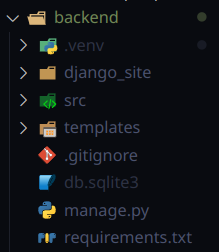

# Гайды

## GIT

>Примечание: Не нужно инициализировать свой локальный репозиторий, для выполнения задачи, и не нужно связывать свой созданный локальный репозиторий через `git remote add`, потому что это нарушит связь между существующими удалёнными ветками, а конкретно - нарушит `логи`. Просто склонируйте репозиторий, после чего ужё в нём наследуйтесь от нужной вам ветки, создавая новую свою.

### Ваша работа с `GIT`, должна выглядеть следующим образом:
---
###  1. Клонирование репозитория
```bash
git clone https://gitlab.informatics.ru/2024-2025/online/s111/simple-votings-g1.git
```

### 2. Создание отдельной ветки, для выполнения задания

```bash
git branch feature/"название_задания"
```
или

```bash
git branch -b feature/"название_задания"
```

Чтобы сразу создать и перейти в новую ветку.

### 3. Переход на существующие ветки

```bash
git checkout "название ветки"
```

### 4. Убедитесь, что вы работайте в нужной ветке

```bash
git status
```

### 5. Подготовить файлы к ревизии (комиту)

Если хотите добавить все папки и файлы в текущей директории:
```bash
git add .
```

Если хотите добавить конкретные файлы:

```bash
git add "название файла"
```

### 6. Закоммитить 

```bash
git commit -m "комментарий, что сделал"
```

### 7. Отправить на удалённый репозиторий

```bash
git push origin "название вашей ветки"
```

### 8. Уйти с чувством выполненного долга.

## Работа с `Django`

### Немного о структуре проекта



Да, как вы видите, **серверная часть** нашего проектанаходится в отдельной папке `backend`