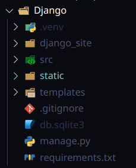

# Гайды

## GIT

>Примечание: Не нужно инициализировать свой локальный репозиторий, для выполнения задачи, и не нужно связывать свой созданный локальный репозиторий через `git remote add`, потому что это нарушит связь между существующими удалёнными ветками, а конкретно - нарушит `логи`. Просто склонируйте репозиторий, после чего ужё в нём наследуйтесь от нужной вам ветки, создавая новую свою.

### Ваша работа с `GIT`, должна выглядеть следующим образом:
---
###  1. Клонирование репозитория
```bash
git clone https://gitlab.informatics.ru/2024-2025/online/s111/simple-votings-g1.git
```

### 2. Создание отдельной ветки, для выполнения задания

```bash
git branch feature/"название_задания"
```
или

```bash
git branch -b feature/"название_задания"
```

Чтобы сразу создать и перейти в новую ветку.

### 3. Переход на существующие ветки

```bash
git checkout "название ветки"
```

### 4. Убедитесь, что вы работайте в нужной ветке

```bash
git status
```

### 5. Подготовить файлы к ревизии (комиту)

Если хотите добавить все папки и файлы в текущей директории:
```bash
git add .
```

Если хотите добавить конкретные файлы:

```bash
git add "название файла"
```

### 6. Закоммитить 

```bash
git commit -m "комментарий, что сделал"
```

### 7. Отправить на удалённый репозиторий

```bash
git push origin "название вашей ветки"
```

### 8. Уйти с чувством выполненного долга.

## Работа с `Django`

### Немного о структуре проекта



## Директории

### `django_site`

#### Папка приложения, в ней хранится всё необходимое, для работы приложения, вся **бизнес-логика**.


Из файлов этой директории, можно подметить основные: 

* `models.py` - **модель**, представляет собой классы `Python`, которые описывают структуру данных и используются для взаимодействия с базой данных

* `views.py` - **контроллер**. **Контроллеры** в `Django` называются представлениями (views), они отвечают за обработку `HTTP-запросов` и взаимодействие с **моделью данных**.

### `src`

#### Папка проекта, в ней хранятся основные настройки проекта.


Из файлов этой директории, можно подметить основные:

`settings.py` - настройки проекта, в них мы указываем, например, какая папка будет являться нашим **приложением**, или, какая папка будет хранить **шаблоны**

>Примечание: При клонировании репозитория, данный файл уже настроен.

`urls.py` - используется для определения `URL-адресов`, которые будут доступны в вашем `веб-приложении`. Он связывает конкретные `URL-пути` с соответствующими **представлениями** (`views`), которые обрабатывают **запросы** пользователей.

### `static`

Папка для статических файлов (фотки, стили и т.д)

### `templates`

Шаблоны проекта.  
Если не знаете что это такое, пересмотрите [занятие](https://lms.informatics.ru/pupil/calendar/701362/units/steps/2830712/elements/7169066) по использовании *шаблонов* `Django` в `informatics`, лол.